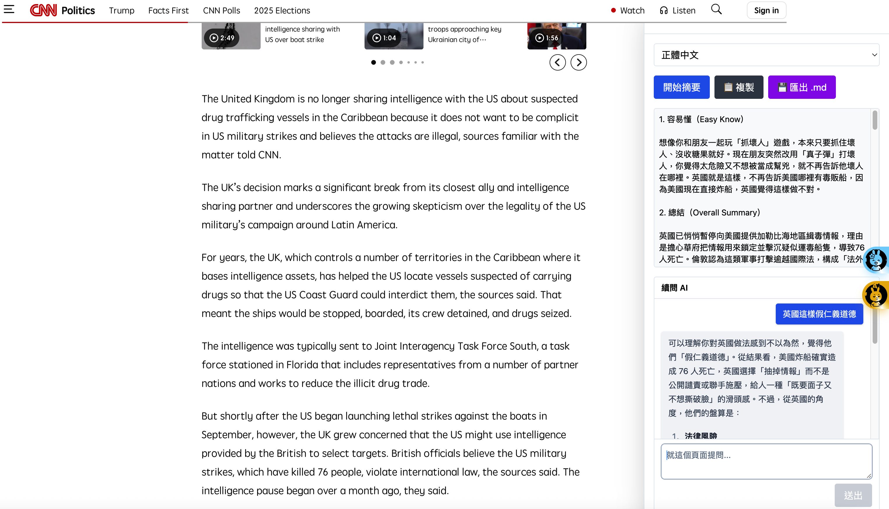
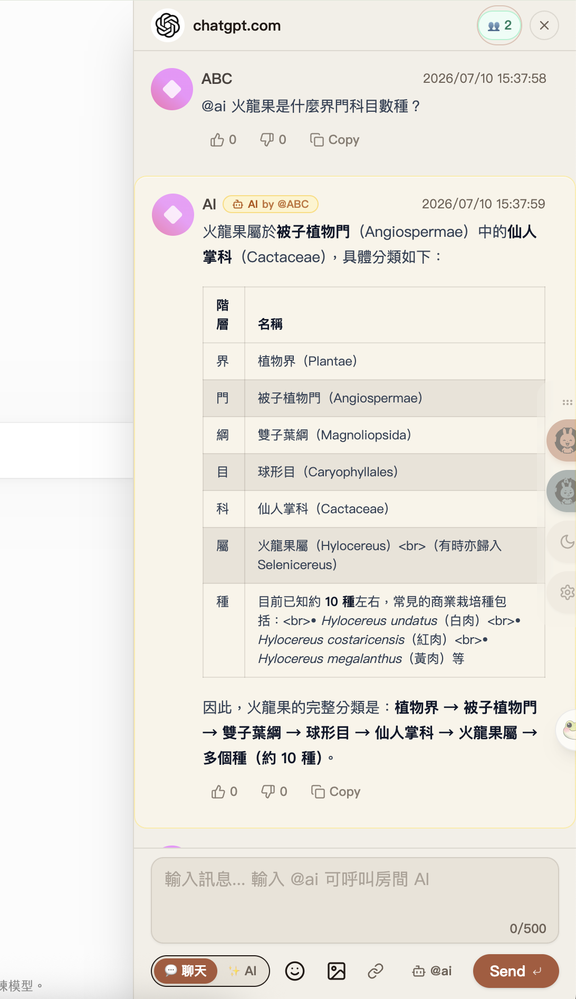

# 🕸️ Chrome WebTalk - 網頁聊天室擴充功能

> 在任何網站上與他人匿名即時聊天！可以提供LLM 幫你了解網頁內容
>
> 
> 
> 這是一款去中心化、無伺服器的瀏覽器聊天擴充功能，透過 WebRTC 實現端對端加密傳輸，保護你的隱私，所有資料皆儲存在本地裝置。

本版本 fork 自 [molvqingtai/WebChat](https://github.com/molvqingtai/WebChat)，並進行以下改進：

- ✅ 使用其他建的 WSS 通訊站台，與原專案用戶分流
- 🎨 全新設計的使用者介面，提升操作體驗與可讀性
- 🧠 新增 AI 摘要功能，一鍵生成網頁內容摘要，提高閱讀效率

### 🌐 Website Embed

除了 Chrome Extension，本專案也提供可嵌入一般網站的 `webtalk.js`。合作網站可以依需求選擇整個網域共用房間，或由每個 Share 頁動態提供：

```html
<meta name="webtalk-page-id" content="{{dynamic-page-id}}" />
<script
  src="https://your-webtalk-host.example/webtalk.js"
  data-webtalk-scope="meta"
  data-webtalk-ai-endpoint="https://your-webtalk-host.example/api/webtalk/ai"
></script>
```

沒有 page meta 的頁面不應載入 Embed script，例如 Wiki edit 頁；CRM 則可以使用 `data-webtalk-auto-mount="false"`，在登入成功後呼叫 `window.WebTalk.mount()`。完整參數請參考 [Website Embed 說明](docs/web-embed.md)，Vercel 部署步驟請參考 [Vercel 部署指南](docs/deploy-vercel.md)。

安裝後，你將能在任何網站上開啟聊天室，再也不怕一個人上網啦！還能使用 AI 摘要功能快速了解網頁內容！

---

## 🆕 近期更新

- 🚀 **Website Embed 與 Vercel AI proxy (v2.0.3)**：新增可嵌入一般網站的 `webtalk.js`，支援動態 `webtalk-page-id`、`meta / origin / path` 房間策略、匿名本地頭像與 P2P 聊天；新增通用 `LLM_*` Vercel 環境變數，文字模型與 Vision 模型可使用不同 Base URL。Chrome Extension 維持原本的網域房間與直接 API 設定。
- 👤 **Dicebear 更多風格與不同網站不同頭像選項 (v2.0.1)**：
  - **擴充 Dicebear 頭像包**：追加 `adventurer-neutral` (冒險者)、`big-smile` (笑臉)、`pixel-art` (像素風)、`notionists` (Notion 風) 四種新風格。
  - **「不同網站不同頭像」選項**：設定頁新增開關，預設開啟。開啟後，在不同的網域中聊天的頭像會自動隨機產生且不同；關閉後則回退為全域頭像。
- 🎨 **大改版！底欄極簡化與 Dicebear 本地頭像 (v2.0.0)**：
  - **極簡一列式底欄**：將模式切換 `PanelModeSwitch` 簡化為「純圖標」膠囊，寬度減半；並將 `@ai`、`🔗` 按鈕微調為 icon-only 樣式，並移除換行限制，完美合為一排，為未來功能（如語音輸入）預留大片空間。
  - **統一輸入框**：AI 空間底端改用 `<MessageInput>` 元件，獲得字數計算器（`0/500`）、相同圓角與高亮等一致體驗。
  - **極簡 Markdown 複製**：複製統一為單一圖標按鈕，含有網頁連結的訊息會自動複製為 Markdown 格式 `[標題](網址)`，更適應 LLM 輸出。
  - **Dicebear 本地頭像**：替換幾何漸層頭像為本地 `@dicebear` 動態生成的 `lorelei` / `lorelei-neutral` / `big-ears-neutral` 隨機精美頭像，100% 本地與離線運作，免申請任何外部 API 與 Chrome 跨域權限，保障上架順暢。
- 🔠 **AI 空間頂部字級放大與贅詞清理 (v1.6.8)**：放大 AI 空間語系切換、`歷史`、`⚙️` 等頂部控制列字級與按鈕尺寸，讓它們更貼近整體視覺語言；推薦區多餘說明文字也已移除，避免版面噪音。
- 🧩 **Footer 版型統一與壓線修復 (v1.6.7)**：聊天室與 AI 空間的 footer 現在改為一致的「輸入區卡片 + 下方工具列」結構，`聊天 / AI` 切換、工具按鈕與送出按鈕會自動換行與保留安全間距，不再被擠進螢幕邊界。
- 🧠 **AI 空間多圖 + 自動模型路由 (v1.6.6)**：AI 空間現在支援多張圖片、縮圖預覽與單張移除；當提問不含圖片時，系統會自動走文字/推理模型 `openai/gpt-oss-120b`，一旦附圖則自動切到視覺模型。設定頁也新增 `Vision Model` 欄位，可自行指定圖片問答使用的 Groq model。
- 🖼️ **AI 空間支援圖片問答與共用切換膠囊 (v1.6.5)**：AI 空間現在可上傳單張圖片並直接對圖片提問；實作改走 Groq 官方支援的 vision 請求格式。聊天室與 AI 空間左下角的 `聊天 / AI` 切換膠囊也改為共用同一個元件，樣式完全一致。
- 🎨 **聊天室 UI 向 AI 空間收斂 (v1.6.4)**：聊天室的版型、空狀態、訊息區容器、輸入區卡片與 header 視覺全面往 AI 空間靠攏，統一為較新的圓角卡片、柔和底色與較寬鬆的間距，降低兩套面板的割裂感。
- 💡 **AI 推薦議題 / 推薦問題開關 (v1.6.3)**：聊天室與 AI 空間現在可根據當前頁面的 `title / URL / 文字內容`，由 LLM 自動提出幾個可點選的討論議題或追問方向。聊天室只會把議題帶入輸入框，不會直接廣播；AI 空間則會提供可直接帶入提問框的推薦問題。設定頁也新增 `AI 推薦議題` 開關，預設開啟，可隨時關閉。
- 🧠 **AI 空間與聊天室 AI 邏輯收斂 (v1.6.2)**：AI 空間現在和聊天室 `@ai` 共用同一套 API client / 設定讀取邏輯，並支援直接聊天，不必先摘要。兩邊都會帶入更完整的頁面上下文；AI 空間若已有摘要，也會一併帶入。這也修正了部分長頁面下 AI 空間明明 API Key 正確卻仍失敗的問題。
- 🔌 **送訊時序穩定化 (v1.6.1)**：修正剛進房或剛建立 peer connection 的短時間內，聊天室偶發跳出 `Connection is not established yet.` 的假性錯誤。公開訊息與 `Like / Hate` 現在改為逐 peer 發送，並對尚未 ready 的單一 peer 做短暫自動重試。
- 🧩 **Private / AI extension 疊上 upstream text (v1.6.0)**：`upstream` 模式下，私聊文字與 `@ai` 房間回覆不再退回 legacy `Text` payload，而是改用 upstream `text` + fork 專用 optional `extension` metadata。這讓公開聊天室更貼近原版 WebChat，同時保留這個 fork 的 AI/私聊能力。
- 🕰️ **Upstream HLC / reaction 第二階段 (v1.5.9)**：`upstream` 相容模式下，公開聊天室現在會為 `text / reaction / peer-sync / history-sync` 維護 HLC 排序，`👍 / 👎` 也開始改走 upstream reaction 封包，跨 peer 順序與互動狀態比 `v1.5.8` 更接近原版 WebChat。
- 🔀 **原版 WebChat 公開聊天室相容模式初版 (v1.5.8)**：設定頁新增 `Chat Protocol` 切換。切到 `upstream` 後，公開聊天室會開始嘗試用原版 `molvqingtai/WebChat` 的 `peer-sync / text / history-sync` 協定互通；私聊、AI metadata 與 reaction 仍會在後續版本逐步對齊。
- 🧱 **聊天室協定重構地基 (v1.5.7)**：抽出獨立 `protocol` 層與 adapter，開始把聊天室 wire format 從舊有 domain 內聯結構中拆出，為未來逐步靠攏 upstream `molvqingtai/WebChat` 協定做準備。
- 🌐 **可選介面語系與 AI 回覆語言 (v1.5.6)**：設定頁新增 `Interface Language`，可選 `Auto / 繁體中文 / 简体中文 / English`。`@ai` 房間回覆也會跟隨這個設定，選繁中時會明確要求 AI 使用繁體中文。
- 🤖 **`@ai` 房間回覆機器人 (v1.5.5)**：在公開聊天室輸入 `@ai ...`，會由發送者本機呼叫 AI，再把回覆作為獨立 AI 訊息推回聊天室，適合多人共同討論頁面內容。
- 🪪 **AI 訊息獨立樣式與本地過濾 (v1.5.5)**：AI 回覆現在會以特殊框線與 `AI` badge 顯示，且不再進入彈幕；你也可以在本地封鎖某位使用者時同步隱藏他觸發的 AI，或直接在設定頁隱藏全部 AI 訊息。
- 🧼 **Options 頁遮擋與字體整理 (v1.5.5)**：修復設定頁底部 `GitHub / 開源專案` 浮動遮擋內容的問題，並將整個聊天/設定介面收斂為一致的中英混排字體系統。
- 🧰 **開發者模式與 Header 精簡 (v1.5.4)**：新增 `Developer Mode` 開關，將跨網站在線站點清單收進開發者專用除錯入口；一般使用者只看到當前網站名稱與精簡的 `👥` 在線人數徽章，不再暴露多餘的切換入口。
- 📋 **單篇訊息 Copy / 倒讚工具列 (v1.5.4)**：每則聊天訊息底下新增類似 Gemini / ChatGPT 的輕量操作列，支援 `👍`、`👎` 與單篇 `Copy` 複製內文。
- ⚠️ **訊息長度到頂主動警示 (v1.5.4)**：保留 500 字元上限，但接近上限時會變色提示，撞到上限時會直接跳出警告，不再像被靜默截斷。
- 🔒 **P2P 私密對話安全加固 (v1.5.2)**：修復 LastMessageTimeQuery 洩漏私聊 metadata、Like/Hate 全房間廣播、多分頁私聊目標誤清、歷史同步天數計算反向等問題。
- 🔒 **P2P 私密對話隱私修復 (v1.5.1)**：修復私聊消息對所有用戶可見的隱私漏洞。現在私聊消息僅雙方可見，歷史同步也排除私聊內容，並限制非參與者的互動權限。
- 🔒 **P2P 私密對話功能 (v1.5.0)**：導入基於 WebRTC P2P 的定點私聊機制。使用者可透過點擊對話頭像或右上角在線用戶列表開啟私聊，發送的訊息僅雙方可見，且畫面會呈現高質感的靛藍色光暈與鎖頭徽章。詳細架構請參考 [房間機制與 P2P 私聊設計文件](docs/room-mechanism-and-private-chat.md)。
- 🧠 **預置實驗 Key、預設模型更換與 Groq 引導 (v1.4.0)**：預設模型更改為 `openai/gpt-oss-120b`，API 改為引導至 Groq Console。內建預置實驗 API Key `gsk_ZXLmQT*****`，並增強錯誤處理，當實驗 Key 請求失敗或超出限額時，會顯示引導錯誤說明引導使用者自行更換 API Key。
- ✕ **聊天室 Header 關閉按鈕壓線溢出修正 (v1.4.0)**：重新調整 Header 佈局，由原先的限制性網格改為自適應彈性 `flex` 排版，確保關閉 `✕` 按鈕在任何視窗解析度下均不會靠右過度壓線或甚至超出畫面。
- 💬 **漂浮對話氣泡超長句子截斷修正 (v1.3.9)**：將網頁漂浮對話氣泡/彈幕的最大寬度從 `max-w-44` (176px) 擴展至 `max-w-[480px]`，徹底修復超長英文、中文句子被過早砍斷、顯示不全的 Bug。
- 🧾 **AI 空間「單一對話流」大重構 (v1.3.8)**：重整為與主流 AI（ChatGPT/Claude）相同的單一對話聊天流。網頁摘要成為最頂端置頂 of AI 消息，提問與後續續問氣泡無縫向下延伸。
- 🎨 **溫潤拿鐵書香配色 (Warm Latte & Papyrus)**：界面配色深度優化，採用大氣柔和的淡米黃底色、深烘焙咖啡色字體與栗子磚紅主色調，長時間閱讀極度舒適。
- 🔤 **大字型與自訂字型物理路徑**：為照顧視力，所有面板正文及輸入文字均提升至 `text-base` (16px)；修正 MapleMono 與 JetBrainsMono 物理路徑並解鎖 CSP，解決 Extension 本地字型加載 404 問題。
- ⚡ **兔子 Dock 4px 防抖點擊修復**：為懸浮拖曳 Dock 引入 4 像素防抖閾值，徹底解決滑鼠微小抖動導致點擊沒反應的 Bug。
- 🔄 **左下角雙鍵導航膠囊**：於聊天室與 AI 空間最左下角引入 `[ 💬 聊天 | ✨ AI ]` 對齊雙鍵 Tab，切換隨心所欲。
- ❌ **統一右上角 X 關閉**：兩個面板的 `X` 關閉按鈕统一設計為精緻的圓圈 `XIcon` 並放置於最右上角。
- 🧹 **消滅狗皮藥膏不對齊**：AI 空間頂部控制列高度完全齊平（統一為 `h-7` / `size-7`），毫無高低起伏，視覺大升級。

---

## 🚀 安裝方式

### 從瀏覽器擴充商店安裝

https://chromewebstore.google.com/detail/webtalk/hhhdloelamldfadfobnhdhpfmbbdppdb

### 手動安裝

1. 前往 [本專案 Releases 頁面](https://github.com/tbdavid2019/chrome-webtalk/releases)
2. 點選最新版本中的 `webtalk-*.zip`
3. 解壓縮 ZIP 檔到你的電腦資料夾中
4. 開啟瀏覽器的擴充功能管理頁（例如 Chrome 輸入 `chrome://extensions/`）
   - 開啟右上角「開發人員模式」
   - 點選「載入未封裝項目」，選取剛剛解壓縮的資料夾

### 原始建構

```
pnpm build

```

會產出 output/

---

## 💬 使用說明

當擴充功能安裝完成後，會在每個網站的右側出現兩個小圖示：

- **聊天室圖示**（上方）：點擊它，就能開啟聊天室，與其他正在同個網站上的使用者即時聊天！
- **AI 摘要圖示**（下方黃色）：點擊它，可以快速生成當前網頁內容的 AI 摘要，包含總結、觀點、關鍵字等，幫助你快速了解網頁內容。

### 聊天操作補充

- **單篇操作列**：每則訊息底下都有 `👍`、`👎` 與 `Copy` 按鈕，可直接複製單篇訊息內容，或對該則訊息表達正負回饋。
- **`@ai` 房間回覆**：在公開聊天室輸入 `@ai 你的問題`，會由你本機的 AI 設定產生回覆，再把 AI 回覆廣播到房間中。為避免濫用，目前同一時間只允許一個 AI 請求，且有 `30` 秒冷卻時間。
- **AI 推薦議題 / 問題**：若設定頁保持預設開啟，聊天室輸入框上方會出現幾個根據當前頁面內容產生的推薦議題；AI 空間也會顯示推薦問題。點擊後只會帶入輸入框，仍由你決定是否送出。
- **語系控制**：到設定頁的 `Interface Language` 可切換介面語言，`Auto` 會跟隨瀏覽器；`@ai` 房間回覆也會跟著這個設定決定回答語言。
- **AI 訊息管理**：AI 回覆會以獨立樣式顯示，不會進入彈幕；你可以封鎖某位使用者並同步隱藏他觸發的 AI，或在設定頁開啟 `Hide All AI Messages` 完全隱藏 AI 訊息。
- **訊息長度提示**：聊天輸入框目前上限為 `500` 字元；接近上限會變色提醒，達到上限時會主動顯示警告。
- **Developer Mode**：若你是進階使用者，可到擴充功能設定頁開啟 `Developer Mode 開發者模式`，顯示跨網站 presence 與站點切換/debug 入口。
- **原版相容測試模式**：若你想逐步和原版 `molvqingtai/WebChat` 公開房間互通，可在設定頁把 `Chat Protocol` 切到 `Upstream`。目前公開聊天室優先對齊 `peer-sync / text / history-sync / reaction`；私聊與 AI 會以 fork 專用 `extension` metadata 疊在 upstream text 上，只在支援這個 fork 的 peer 之間完整還原。

---

## ⚙️ WebRTC 架構速記

- **Signaling**：擴充功能的 `Peer` 直接繼承 `@rtco/client` 的 `Artico`（`src/domain/impls/Peer.ts`），未覆寫任何設定，因此會連到 Artico 預設的 Socket signaling 伺服器 `https://0.artico.dev:443`，用來交換 SDP 與 ICE candidate。
- **STUN / TURN**：`@rtco/client` 內建的 `RTCConfiguration` 只列出 Google 的公開 STUN（`stun:stun.l.google.com:19302`、`stun:stun1.l.google.com:19302`），僅協助取得公網位址並不會中繼資料；目前未設定 TURN，所以遇到嚴格 NAT 可能需要自備 coturn。
- **RTCConfiguration**：所有 `RTCPeerConnection` 都沿用 `Artico` 的預設 `rtcConfig`；若要指定自家 STUN/TURN 或自架 signaling，可在 `Peer.createInstance` 之外新增參數並傳給 `Artico`。
- **為什麼要關心**：免費 signaling 僅適合開發／測試，正式環境仍建議自建或評估商用服務，以取得可控的節點數、SLA 與資安策略。

---

## 🧱 聊天運作流程

- **房間如何形成**：內容腳本會把 `location.host` 轉十六進位作為房號（`src/domain/impls/ChatRoom.ts`），同一個網域的使用者都連到同一房間。
- **即時傳輸**：`ChatRoom` 透過 WebRTC DataChannel 序列化訊息並廣播給房內 peer（`src/domain/impls/ChatRoom.ts`），完全端對端。
- **歷史同步**：每個節點本地保留完整訊息；新 peer 加入時，舊 peer 依最後訊息時間批次推送近 `SYNC_HISTORY_MAX_DAYS`（預設 3 天）的紀錄，避免漏掉談話（`src/domain/ChatRoom.ts:332-470`）。
- **本地儲存**：使用 `unstorage` 驅動的 IndexedDB/LocalStorage 保存訊息與設定（`src/domain/impls/Storage.ts`），即使離線或重新載入也能保留記錄，再由其他節點補齊差異。

---

## 🙌 技術來源與致敬

本專案建立在以下開源技術之上，特此致敬：

- **[remesh](https://github.com/remesh-js/remesh)** – 遵循 DDD 原則的 JS 架構，邏輯與 UI 完全分離，極易擴充與重構。
- **[shadcn/ui](https://ui.shadcn.com/)** – 美觀又彈性的 UI 元件庫，無需安裝即可自訂樣式。
- **[wxt](https://wxt.dev/)** – 極佳的瀏覽器擴充套件開發框架。
- **[Artico](https://github.com/matallui/artico)** – 建立自定 WebRTC 解決方案的利器。
- **[ugly-avatar](https://github.com/txstc55/ugly-avatar)** – 為用戶產生可愛又獨特的隨機頭像。

---

## 📜 授權條款

本專案採用 MIT 授權，詳情請參閱 [LICENSE](https://github.com/tbdavid2019/chrome-webtalk/blob/main/LICENSE)。

---

# 🌐 Chrome WebTalk - Anonymous Chat Anywhere

> Chat with anyone on any website

This is a decentralized, serverless browser extension that allows real-time, end-to-end encrypted chatting via WebRTC. All data is stored locally to ensure privacy.

This fork, hosted at [`tbdavid2019/chrome-webtalk`](https://github.com/tbdavid2019/chrome-webtalk), includes:

- ✅ A custom WSS server to separate userbase from the original project
- 🎨 A redesigned interface for better user experience and readability
- 🧠 New AI summary feature that generates concise summaries of web pages

---

## 🚀 Installation

### From Store

https://chromewebstore.google.com/detail/webtalk/hhhdloelamldfadfobnhdhpfmbbdppdb

### Manual Installation

1. Go to [Releases](https://github.com/tbdavid2019/chrome-webtalk/releases)
2. Download the latest `webtalk-*.zip`
3. Extract the ZIP file to a folder
4. Open your browser’s extension page (`chrome://extensions/`)
   - Enable **Developer mode**
   - Click **Load unpacked** and select the extracted folder

---

## 💬 How to Use

Once installed, two icons will appear on the right side of any website:

- **Chat icon** (top): Click it to join a shared chatroom with others browsing the same site!
- **AI Summary icon** (bottom, yellow): Click it to generate an AI-powered summary of the current webpage, including key points, opinions, and keywords to help you quickly understand the content.

---

## 🙌 Acknowledgements

Built upon amazing open-source tools:

- **[remesh](https://github.com/remesh-js/remesh)** – DDD-inspired logic framework with full UI separation
- **[shadcn/ui](https://ui.shadcn.com/)** – UI library that enables beautiful, customizable components
- **[wxt](https://wxt.dev/)** – Best framework for browser extension development
- **[Artico](https://github.com/matallui/artico)** – WebRTC library suite for building P2P apps
- **[ugly-avatar](https://github.com/txstc55/ugly-avatar)** – Fun random avatar generator

---

## 📜 License

MIT License – see [LICENSE](https://github.com/tbdavid2019/chrome-webtalk/blob/main/LICENSE) for details.
