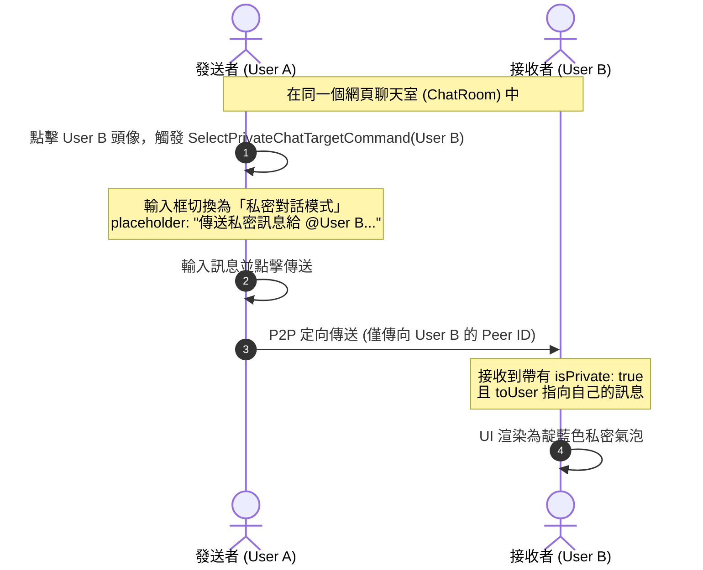

# 🚪 房間機制與 P2P 私聊設計文件

此文件詳細說明本專案的房間連線機制、依賴之外部信令伺服器，以及在版本 `v1.5.0` 中全新導入的 **WebRTC P2P 私聊機制**。

---

## 1. 房間機制與產生方式

專案中主要維護了兩種層級的房間，以適應不同的聊天情境：

### 網頁聊天室 (ChatRoom)
* **目的**：供同一網站瀏覽者之間進行匿名即時對話。
* **產生方式**：
  * 當使用者打開插件，內容腳本會抓取當前分頁的 `document.location.host`（主域名，例如 `github.com`、`google.com`）。
  * 透過 `stringToHex()` 方法將主域名轉換為唯一的十六進位字串，作為此網站專屬的 `roomId`：
    ```typescript
    // src/domain/impls/ChatRoom.ts
    const hostRoomId = stringToHex(document.location.host)
    ```
  * 這能確保在同一個網站上的所有用戶，在開啟插件時會被導流至同一個聊天房中。

### 虛擬聊天室 (VirtualRoom)
* **目的**：一個跨網站的全局公共大廳。
* **產生方式**：
  * 使用固定的字串標記 `WEB_TALK_VIRTUAL_ROOM`，同樣透過 `stringToHex()` 轉成十六進位字串作為房號。
  * 所有安裝本插件的使用者皆可在此大廳中進行全域聊天。

---

## 2. 依賴伺服器 (信令伺服器)

本插件為 **去中心化、無伺服器 (Serverless)** 的架構，文字及圖片傳輸皆使用 WebRTC DataChannel 連線進行，本身不依賴任何訊息存儲伺服器。

然而，WebRTC 在連線建立前，需要一個媒介來交換雙方的聯絡資訊 (SDP Offer/Answer 和 ICE Candidates)，此過程稱為 **信令 (Signaling)**。

* **依賴套件**：使用開源庫 `@rtco/client` (Artico)。
* **預設信令伺服器**：
  * 在未傳入自訂信令伺服器的情況下，預設會連線至 Artico 的公用信令伺服器：
    👉 **`https://0.artico.dev:443`** (透過 WebSocket 進行信令交換)。
  * **注意**：一旦信令交換完成且 P2P 連線建立，雙方的數據便會直接透過瀏覽器互相傳輸（P2P 加密），**訊息內容不會經過或儲存在信令伺服器上**。

---

## 3. P2P 私聊 (Private Chat) 機制

在 `v1.5.0` 版本中，我們重構了訊息與狀態管理架構，在不引入第三方伺服器的情況下，完全基於 WebRTC 原生的 P2P 定向發送特性，實現了高隱私、高質感的私聊功能。

### 運作原理與架構



### 核心實作細節

#### A. 狀態管理 (Remesh Domain)
我們在 `ChatRoomDomain` 中擴充了私聊目標的維護狀態：
* **`PrivateChatTargetState`**：儲存目前被選為私聊目標的 `RoomUser` 資訊，若為 `null` 則為公開群聊。
* **`SelectPrivateChatTargetCommand`**：用來設定/切換私聊目標。
* **`PrivateChatTargetQuery`**：供前端組件訂閱，以動態變更輸入框與列表狀態。

#### B. 訊息定向傳送 (Targeted Messaging)
`@rtco/client` 在 `room.send` 方法中，支援傳入特定 Peer ID 陣列。當我們發送訊息時，會檢查目前是否存在 `privateChatTarget`：
* 如果**是**私密對話：
  * 訊息物件會標記 `isPrivate: true`，且包含 `toUser` 物件（接收者的 ID 與名字）。
  * 僅發送給目標的 `peerIds`，房內的其他使用者**完全不會收到此連線數據封包**：
    ```typescript
    // src/domain/ChatRoom.ts 中的 SendTextMessageCommand 實作片段
    if (privateTarget) {
      chatRoomExtern.sendMessage(textMessage, privateTarget.peerIds) // 定向發送
    } else {
      chatRoomExtern.sendMessage(textMessage) // 廣播
    }
    ```
* 本地端也會同步將訊息插入自己畫面上，並標記為私聊（因為 P2P 定向發送不會廣播回自己）。

#### C. 自動清除失效目標
為了避免發送給已離線的用戶，在 `OnLeaveRoomEffect` 效應中加入檢測：如果目前私聊的對象離開了房間（離線），系統會自動呼叫 `SelectPrivateChatTargetCommand(null)` 解除私聊狀態。

---

## 4. 前端 UI/UX 設計特色

本功能依照 Premium 高級感的視覺指標設計，提供直覺且流暢的體驗：

* **頭像與列表快捷觸發**：
  * 在聊天室的訊息流中，點擊任何使用者的頭像，若對方在線，會立刻切換為與該用戶的私密對話模式（再次點擊即可取消）。若對方已離線，會跳出 Toast 警告。
  * 點擊頂部 `ONLINE` 人數選單中的用戶，亦可直接開啟私聊。選單中被選為私聊的對象會以靛藍色高亮並附帶 `🔒 私聊` 徽章。
* **輸入框私密模式提示**：
  * 當進入私聊模式時，Footer 輸入框上方會滑入一個靛藍色的 **「私密對話中」狀態列**，包含動態呼吸燈指示器及快速取消按鈕。
  * 輸入框的 Placeholder 會自動變更為 `傳送私密訊息給 @[使用者名稱]...`。
* **精緻的私密訊息渲染**：
  * 聊天室裡的私密訊息會帶有柔和的**靛藍色光暈底色**，以及**左側一條高亮實體線條**。
  * 名字旁邊會印有 `🔒 私密傳送給 @username`（如果您是發送者）或 `🔒 私密訊息`（如果您是接收者）的迷你徽章。
